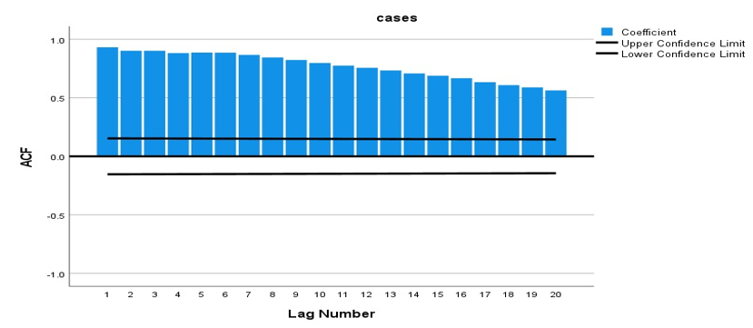
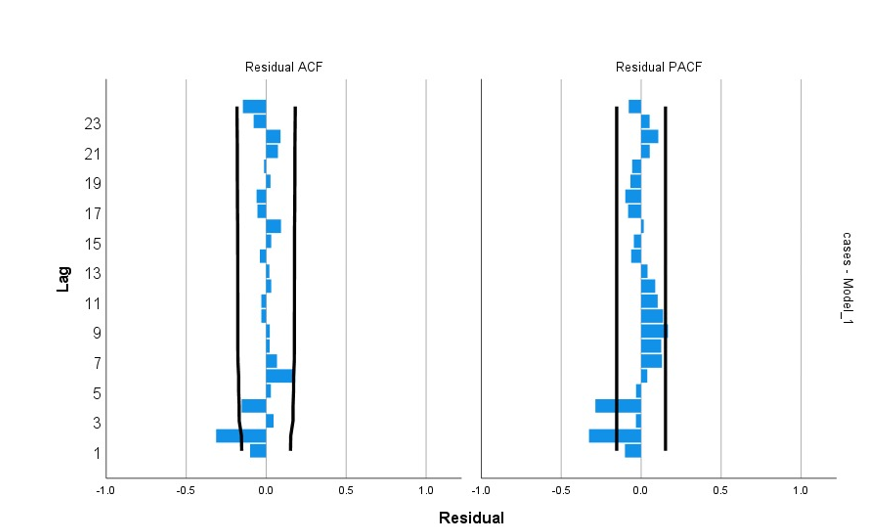
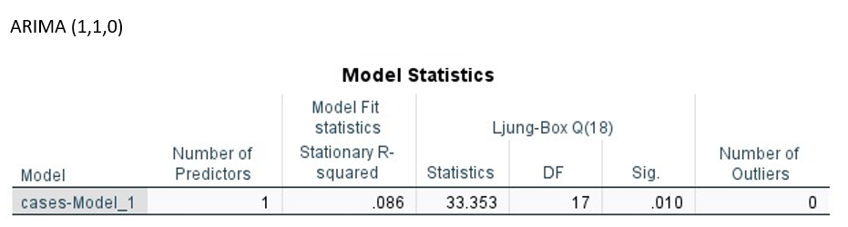
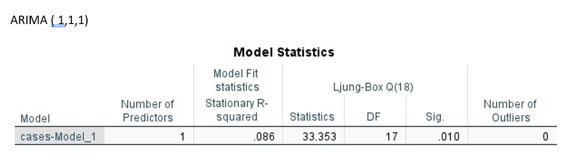
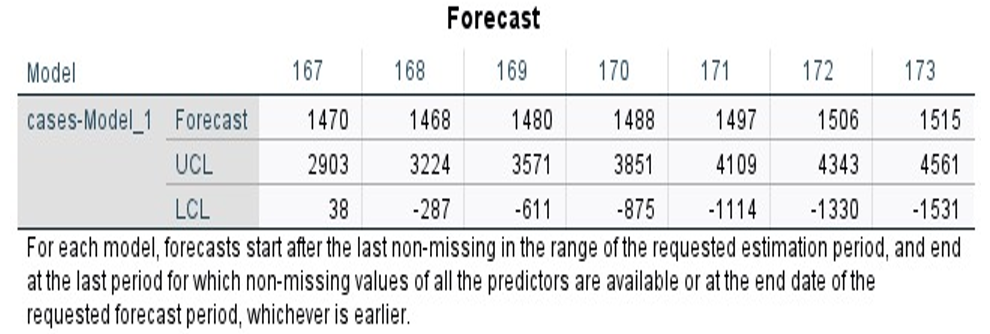
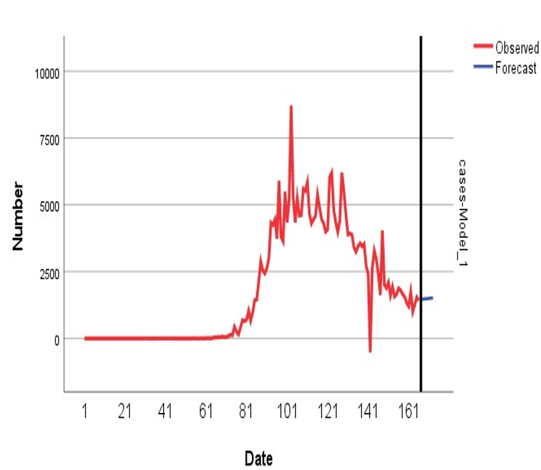
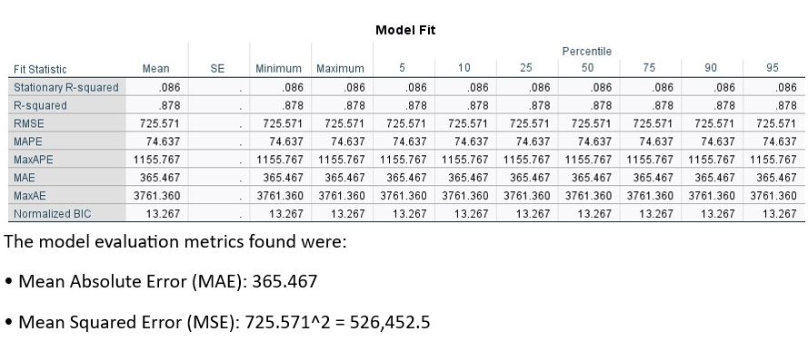

<!DOCTYPE html>
<html lang="en">
<head>
  <meta charset="UTF-8">
  <title>UK Covid-19 Cases Forecasting Project (ARIMA)</title>
</head>
<body style="font-family:Segoe UI, Arial, sans-serif; margin:40px; background:#f8f8f8; color:#222;">
  <h1 style="color:#164194;">UK Covid-19 Cases Forecasting (ARIMA Model)</h1>
  
  <h2>Project Overview</h2>
  

    This project delivers a time series analysis and short-term forecasting of daily UK Covid-19 case counts using ARIMA models, based on data from January 1, 2020 to June 14, 2020. All analysis was conducted in IBM SPSS, aiming to assess stationarity, build a parsimonious ARIMA model, and forecast cases for the period 15–21 June 2020.
  

  
  <h2>Dataset Description</h2>
  <ul>
    <li><b>Source:</b> UK government daily Covid-19 cases data.</li>
    <li><b>Period:</b> 1 January 2020 – 14 June 2020</li>
    <li><b>Frequency:</b> Daily (time series, no missing days)</li>
    <li><b>Variables:</b> Date, Number of new cases</li>
    <li><b>Forecast window:</b> 15–21 June 2020 (out-of-sample)</li>
    <li><b>File Provided:</b> <code>Covid19_uk.xlsx</code></li>
  </ul>

  <h2>Analysis Workflow</h2>
  <ol>
    <li>Data inspection and cleaning</li>
    <li>Check for stationarity (ACF & PACF of original series)</li>
    <li>Difference the series and confirm stationarity</li>
    <li>Model identification (ARIMA parameter selection)</li>
    <li>Model estimation and diagnostics</li>
    <li>Forecasting for the next 7 days</li>
    <li>Model evaluation (MAE, MSE, residual analysis)</li>
  </ol>

  <h2>1. Assessing Stationarity</h2>
  

    The ACF of the original series shows strong, slowly decaying autocorrelation, indicating non-stationarity. The PACF has a strong lag-1 spike, typical for AR processes.
  

  
   
  
  

    After first-order differencing, the ACF cuts off rapidly and the PACF shows reduced spikes, confirming the series is now stationary.
  

  <h2>2. Model Selection and Identification</h2>
  <ul>
    <li>The series was best modelled using an ARIMA(1,1,0) process: 1 autoregressive term, 1 difference, 0 MA.</li>
    <li>Model parameters were significant and model fit judged by AIC/BIC.</li>
    <li>Comparison to ARIMA(0,1,0) and ARIMA(1,1,1) showed that ARIMA(1,1,0) is most parsimonious for short-term forecasting.</li>
  </ul>
  
  

  <h2>3. Forecasting Results</h2>
  

    The ARIMA(1,1,0) model was used to forecast cases for 15–21 June 2020.
  

  
  <ul>
    <li><b>Forecast values:</b> 1470, 1468, 1480, 1488, 1497, 1506, 1515</li>
    <li><b>Upper & lower confidence intervals</b> provided for each date.</li>
  </ul>
  
  <b>Figure:</b> Observed daily cases (red) with ARIMA(1,1,0) forecast for 7 days (blue).

  <h2>4. Model Diagnostics & Fit</h2>
  
  <ul>
    <li><b>MAE:</b> 365.5</li>
    <li><b>MSE:</b> 526,452.5</li>
    <li><b>RMSE:</b> 725.57</li>
    <li><b>R-squared:</b> 0.878</li>
    <li>Stationary R-squared is low due to non-stationarity of the raw series (corrected by differencing)</li>
  </ul>
  
  <b>Figure:</b> ACF of residuals confirms no remaining autocorrelation.
  

  <h2>5. Interpretation and Discussion</h2>
  <ul>
    <li>The ARIMA(1,1,0) model tracks the downward trend in daily Covid-19 cases as of June 2020.</li>
    <li>All parameters are statistically significant; diagnostics confirm model adequacy.</li>
    <li>Residuals are uncorrelated and near zero mean, supporting forecast validity.</li>
    <li>Alternative models (ARIMA(0,1,0) and (1,1,1)) were not significantly better or overfit.</li>
  </ul>

  <h2>6. Conclusion</h2>
  

    The chosen ARIMA(1,1,0) model provides a simple and effective means to forecast daily Covid-19 cases over short windows, supporting public health planning with honest evaluation and error bounds. Forecast accuracy (MAE ≈ 365, RMSE ≈ 726) is reasonable given the data volatility. For future work, incorporating exogenous predictors or using more recent data may further improve accuracy.
  

  <h3>References & Files</h3>
  <ul>
    <li><code>Covid19_uk.xlsx</code> (original data)</li>
    <li>SPSS .sav and output files (available upon request)</li>
    <li>All visualizations and tables produced in IBM SPSS</li>
  </ul>

</body>
</html>
